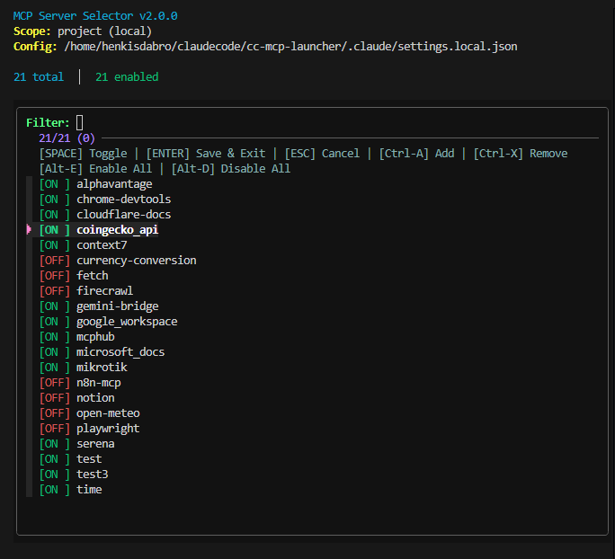

# MCP Server Selector

[](LICENSE)
[]()
[]()

A fast, beautiful TUI for managing MCP (Model Context Protocol) servers in Claude Code. Optimize your context window by enabling only the servers you need, when you need them.



## Why MCP Server Selector?

**Every enabled MCP server bloats your Claude Code context window with tool descriptions, parameters, and usage notes—wasting precious tokens on tools you're not using.**

When you have 20+ MCP servers enabled, Claude's context is filled with hundreds of tool definitions before you even start working. This means:

- **Wasted tokens** on irrelevant tool descriptions
- **Reduced effective context** for your actual code and conversations
- **Slower responses** due to processing unnecessary tool information
- **Higher costs** from inflated token usage

MCP Server Selector solves this with a simple workflow: exit Claude, run `claudemcp`, enable only the 2-3 servers you need for your next task, and launch Claude with a minimal, optimized context window. Toggle servers with a keypress, see changes in real-time, and launch with optimal settings—all in under a second.

## Features

- **Context Window Optimization** - Enable only the MCP servers you need, minimize token waste
- **Interactive TUI** - Fast, intuitive interface powered by fzf
- **Real-time Updates** - Toggle servers instantly with visual feedback
- **Smart Configuration** - Automatically detects project vs global settings
- **Safe by Design** - Never modifies global config without explicit consent
- **Cross-Platform** - Works on Linux and macOS out of the box
- **Zero Dependencies** - Just bash, fzf, and jq (easy to install)

## Quick Start

### Installation

One-line install (recommended):

```bash
curl -fsSL https://raw.githubusercontent.com/henkisdabro/cc-mcp-launcher/main/install.sh | bash
```

### Usage

Simply run `mcp` or `claudemcp` in any directory:

```bash
mcp        # Short command
claudemcp  # Descriptive command (same functionality)
```

The tool will:

1. Detect your Claude configuration (project or global)
2. Launch the interactive TUI showing all available MCP servers
3. Let you enable/disable servers with SPACE (enable only what you need!)
4. Save your changes when you press ENTER
5. **Automatically launch Claude Code** with your optimized, minimal configuration

**Pro tip:** Exit Claude before running this tool to refresh with new settings. Enable only 2-3 servers per session for maximum efficiency.

### Keybindings

| Key | Action |
|-----|--------|
| `SPACE` | Toggle server on/off |
| `ENTER` | Save changes and launch Claude |
| `ESC` | Cancel without saving |
| `Ctrl-A` | Add new server |
| `Ctrl-X` | Remove selected server |
| `Alt-E` | Enable all servers |
| `Alt-D` | Disable all servers |
| `↑/↓` or `/` | Navigate and filter |

## Recommended Workflow

For optimal context window management:

1. **Exit Claude Code** (if running)
2. **Run `claudemcp`** in your project directory
3. **Enable only the 2-3 MCP servers** you need for your next task (e.g., if working with web APIs, enable `fetch`; if debugging time zones, enable `time`)
4. **Press ENTER** - tool saves changes and launches Claude automatically
5. **Work efficiently** with a minimal context window
6. **Repeat when you need different tools** - exit Claude, run `claudemcp`, adjust servers, continue

This workflow ensures Claude's context is focused on your code and task, not filled with unused tool definitions.

## Best Practices

### Minimize Your Global Configuration

After installing this tool, audit your global MCP server configuration:

```bash
# View your global enabled servers
cat ~/.claude/settings.json | jq '.enabledMcpjsonServers'
```

**Recommendation:** Keep your global `~/.claude/settings.json` with minimal or zero enabled servers by default. Instead, use this tool to enable servers on a per-project, per-task basis. This ensures:

- Clean context window when starting new projects
- Explicit control over which tools are available
- Maximum token efficiency across all your work

**Example minimal global config:**

```json
{
  "enabledMcpjsonServers": [],
  "disabledMcpjsonServers": [
    "fetch",
    "time",
    "notion",
    "playwright"
  ]
}
```

Then use `claudemcp` to enable only what you need, when you need it.

## Installation

### Prerequisites

The tool requires three lightweight dependencies:

- **bash** 4.0+ (usually pre-installed)
- **fzf** 0.20+ (command-line fuzzy finder)
- **jq** 1.6+ (JSON processor)

### One-Line Install

```bash
curl -fsSL https://raw.githubusercontent.com/henkisdabro/cc-mcp-launcher/main/install.sh | bash
```

The installer will:

- Check for dependencies and offer to install them
- Clone the repository to `~/.config/mcp-selector`
- Create symlinks in `~/.local/bin/`
- Add `~/.local/bin` to your PATH if needed

### Manual Install

```bash
# Clone the repository
git clone https://github.com/henkisdabro/cc-mcp-launcher.git ~/.config/mcp-selector

# Create symlinks
ln -s ~/.config/mcp-selector/mcp ~/.local/bin/mcp
ln -s ~/.config/mcp-selector/mcp ~/.local/bin/claudemcp

# Make executable
chmod +x ~/.config/mcp-selector/mcp
```

### Installing Dependencies

**Ubuntu/Debian:**

```bash
sudo apt update && sudo apt install fzf jq
```

**macOS:**

```bash
brew install fzf jq
```

**Fedora/RHEL:**

```bash
sudo dnf install fzf jq
```

**Arch Linux:**

```bash
sudo pacman -S fzf jq
```

**Alpine Linux:**

```bash
sudo apk add fzf jq
```

**openSUSE:**

```bash
sudo zypper install fzf jq
```

**NixOS:**

```bash
nix-env -iA nixpkgs.fzf nixpkgs.jq
```

## How It Works

### The Context Window Problem

Every MCP server you enable adds tool definitions to Claude's context window. With 20 servers enabled, you might be using 5,000+ tokens just on tool descriptions before your first prompt. This tool lets you manage this overhead by enabling servers only when needed.

### Configuration Discovery

The tool searches for configuration files in this order:

1. `./.claude/settings.local.json` (project-specific, highest priority)
2. `./.claude/settings.json` (legacy project-specific)
3. New Project Flow (if global config exists but no local config)

### New Project Flow

When you run `mcp` in a directory without local configuration, you'll be prompted to:

1. **Create local config** - Copies global settings to `./.claude/settings.local.json` (recommended)
2. **Use global for this session** - Skips TUI, launches Claude with global settings (read-only)
3. **Abort** - Exit without making changes

**Important:** The tool will never modify your global `~/.claude/settings.json` file. All changes are saved to local project configs.

### State Management

The tool uses a temporary state file to track changes, enabling instant UI updates without touching your settings file until you confirm. This means:

- Blazing fast interactions (sub-50ms toggles)
- Safe experimentation (cancel anytime with ESC)
- Atomic writes (no partial updates or corruption)

### Configuration Format

Settings are stored in JSON format:

```json
{
  "enabledMcpjsonServers": [
    "fetch",
    "time"
  ],
  "disabledMcpjsonServers": [
    "alphavantage",
    "chrome-devtools",
    "notion"
  ]
}
```

## Uninstall

To completely remove MCP Server Selector:

```bash
# Remove symlinks
rm ~/.local/bin/mcp ~/.local/bin/claudemcp

# Remove repository
rm -rf ~/.config/mcp-selector
```

Your Claude configuration files (`.claude/settings.json`) will not be affected.

## Troubleshooting

### Dependencies not found

The installer will detect your package manager and provide installation instructions. See the [Installing Dependencies](#installing-dependencies) section above.

### $HOME/.local/bin not in PATH

The installer will offer to automatically add `~/.local/bin` to your PATH. If you declined or need to do it manually:

**Bash/Zsh:**

```bash
echo 'export PATH="$HOME/.local/bin:$PATH"' >> ~/.bashrc  # or ~/.zshrc
source ~/.bashrc  # or source ~/.zshrc
```

**Fish:**

```bash
echo 'set -gx PATH "$HOME/.local/bin" $PATH' >> ~/.config/fish/config.fish
source ~/.config/fish/config.fish
```

### Can't find claude binary

The tool looks for Claude in:

1. `~/.local/bin/claude` (symlink)
2. Output of `command -v claude`

Make sure Claude Code is properly installed.

## Development

### Project Structure

```
cc-mcp-launcher/
├── mcp              # Main executable
├── install.sh       # Installation script
├── README.md        # This file
├── prd.md           # Product requirements document
└── prd-addendum.md  # Additional requirements
```

### Testing

Create a test settings file:

```bash
mkdir -p ./.claude
cat > ./.claude/settings.local.json <<'EOF'
{
  "enabledMcpjsonServers": ["fetch", "time"],
  "disabledMcpjsonServers": ["notion", "playwright"]
}
EOF
```

Run the tool:

```bash
./mcp
```

### Design Principles

1. **Speed** - Sub-second launch, instant interactions
2. **Safety** - Atomic writes, validation, never corrupt configs
3. **Clarity** - Always show current vs pending state
4. **Portability** - Works on Linux + macOS without modification
5. **Explicitness** - Prompt before creating or modifying configurations

## Credits

Built by [Henrik Söderlund](https://www.henriksoderlund.com) for the Claude Code community.

Powered by:

- [fzf](https://github.com/junegunn/fzf) - Command-line fuzzy finder
- [jq](https://stedolan.github.io/jq/) - JSON processor

## License

MIT License - see [LICENSE](LICENSE) file for details.
